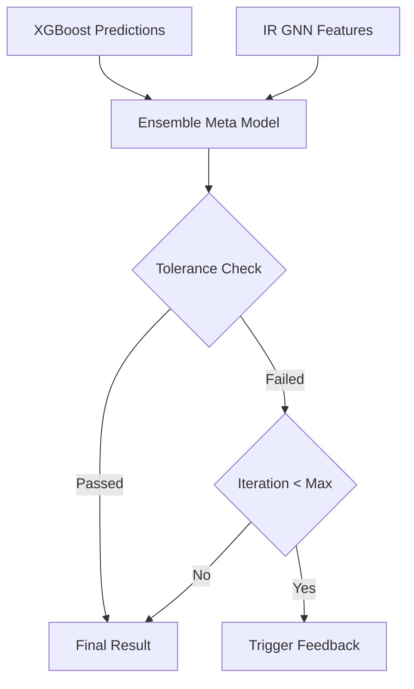

# 역설계 검증 및 메타 모델 (SG_proj_013)

## 1. 개요
역설계된 배합비가 최종 목표 성능을 충족하는지 가상 검증하고 피드백 루프를 제어하는 QA 게이트웨이입니다.

## 2. 시스템 아키텍처

## 3. 기술 스택
- Backend: FastAPI
- Model: XGBoost, GNN

## 4. 참조 문서
- ADR-0001

## 최신 업데이트 내역
## 최신 업데이트 내역 (2026-07-05)
- [CI/CD]: 통합 E2E 테스트 검사 통과 및 전체 모듈 연동 보고서 발간 완료.
- [CI/CD]: 통합 E2E 테스트 검사 통과 및 전체 모듈 연동 보고서 발간 완료.
- [CI/CD]: 통합 E2E 테스트 검사 통과 및 전체 모듈 연동 보고서 발간 완료. (2026-06-29)
- 역설계 1차 승인 판정 수식에서 모의 로직을 걷어내고, 009 모델의 GNN 임베딩 특징을 실시간 수신하여 연동하는 구조 보정 레이어로 교체.

## 5. 향후 개발 계획 (Future Works)
- **기성품 기반 유사도 페널티 (Similarity-based Tuning)**: 001/006 모듈이 역설계한 배합이 현업 공정에서 지나치게 생소해지는 것을 방지하기 위해, 013 모듈의 검증 로직에 004 DB 내 "기존 기성품"과의 **코사인 유사도(Cosine Similarity)** 평가 기준을 도입할 예정.
  - 목표: 가장 유사한 기성품의 베이스를 최대한 유지하며 첨가제나 일부 비율만 미세 조정(Base-Modification)하도록 페널티를 부여.
  - 기대 효과: 현장(양산/제조 부서)에서 즉시 수용 및 생산 가능한 실무 친화적 대안 레시피 도출.

---
*Last Updated: 2026-07-21 (Hybrid Environment & MSA Integration)*
