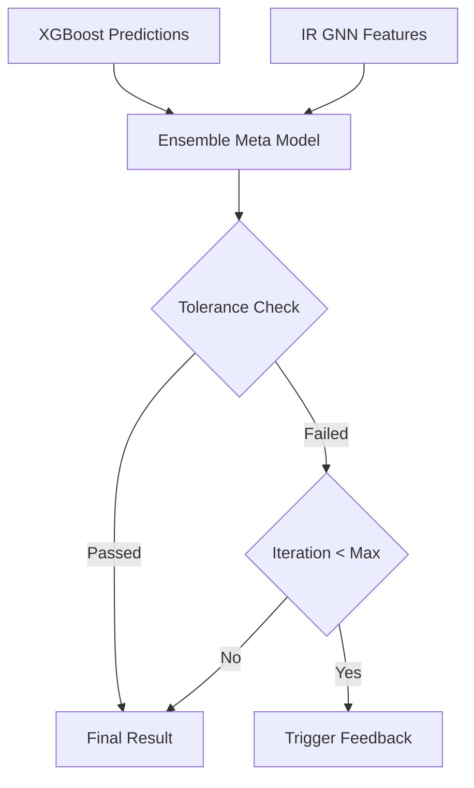

# 역설계 검증 및 메타 모델 (SG_proj_013)

## 1. 개요
역설계된 배합비가 최종 목표 성능을 충족하는지 가상 검증하고 피드백 루프를 제어하는 QA 게이트웨이입니다.

## 2. 시스템 아키텍처

## 3. 기술 스택
- Backend: FastAPI
- Model: XGBoost, GNN

## 4. 참조 문서
- ADR-0001

## 최신 업데이트 내역
## 최신 업데이트 내역 (2026-07-05)
- [CI/CD]: 통합 E2E 테스트 검사 통과 및 전체 모듈 연동 보고서 발간 완료.
- [CI/CD]: 통합 E2E 테스트 검사 통과 및 전체 모듈 연동 보고서 발간 완료.
- [CI/CD]: 통합 E2E 테스트 검사 통과 및 전체 모듈 연동 보고서 발간 완료. (2026-06-29)
- 역설계 1차 승인 판정 수식에서 모의 로직을 걷어내고, 009 모델의 GNN 임베딩 특징을 실시간 수신하여 연동하는 구조 보정 레이어로 교체.
